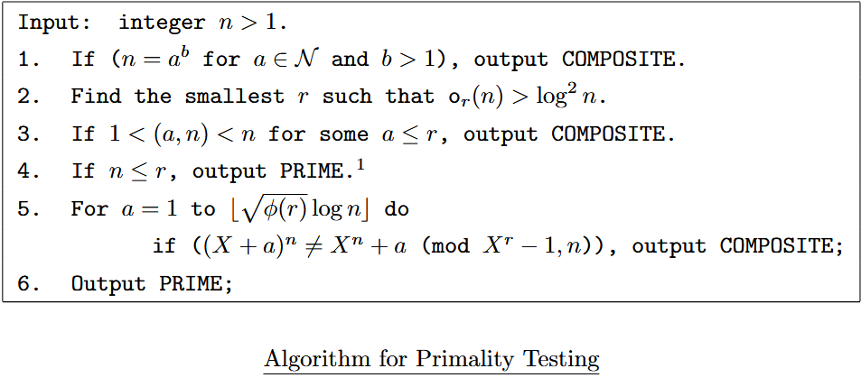

# AKS Algorithm (aks-algo)

## What is this?

_Just a basic implementation of the AKS primality test algorithm in Rust._

The AKS primality test is a deterministic primality-proving algorithm, it was first presented by **Manindra Agrawal**, **Neeraj Kayal**, and **Nitin Saxena** in 2002.

This Rust implementation is just for educational purposes, it's main purpose is to understand the core concepts of the algorithm. It is not fully optimized and as of right now it's not intended to be used in production.

_Developed by Álvaro Buj (@buj8) for the Advanced Theory of Computation course at the UC3M (Universidad Carlos III de Madrid)._

## How does the AKS algorithm work?

From the [original paper](https://www.cse.iitk.ac.in/users/manindra/algebra/primality_v6.pdf) listed in the bibliography:

## Status

**Work in progress...**

Steps implemented:

- [x] 1: If ($n = a^b$ for $a \in \mathbb{N} \land b \gt 1$), output **COMPOSITE**.
- [ ] 2: Find the smallest $r \in \mathbb{N}$ such that $o_r(n) \gt \log^2 n$.
- [ ] 3: If $1 \lt \gcd(a, n) \lt n$ for some $a \leq r$, output **COMPOSITE**.
- [ ] 4: If $n \leq r$, output **PRIME**.
- [ ] 5: For $a = 1$ to $\lfloor \sqrt{\phi(r)} \log_2 n \rfloor$, do if $(X + a)^n \neq X^n + a \mod (X^r - 1, n)$, output **COMPOSITE**.
- [x] 6. Output **PRIME**.

## Bibliography

- [Wikipedia - AKS primality test](https://en.wikipedia.org/wiki/AKS_primality_test)
- [Original paper by Agrawal, Kayal, and Saxena](https://www.cse.iitk.ac.in/users/manindra/algebra/primality_v6.pdf)
